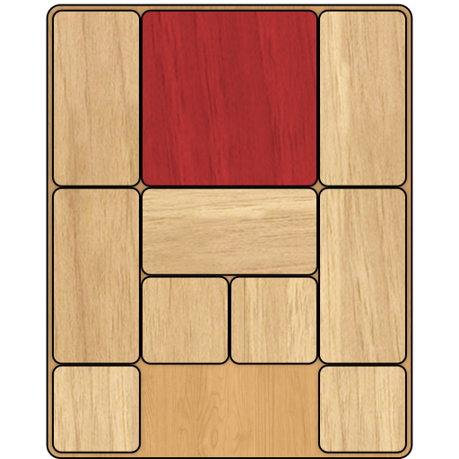

# Overview

## Game
Klotski is a simple wooden sliding block puzzle game originating from the 2oth century. In the case of this project, Klotski refers to a specific layout of 10 blocks where the goal is to move the largest block out of the board. In this configuration, there is 1 2x2 block, 5 1x2 blocks, 4 1x1 blocks, and two empty spaces in a 3x5 grid. To get the special 2x2 piece to the goal, the empty spaces must be manipulated to slide the rest of the blocks out of the way.

<p align="center">
  
</p>

## Optimal Solution

TODO

## Notation and Formatting

### Input Formatting
The input format for this program is a text file with five lines and four numbers on each line (no spaces). 0 represents an empty space, 1 represents 1/4 of the 2x2 piece, 2-6 repersent 1/2 of a 1x2 piece and 7 represents a 1x1 piece. An example of this format can be found in start_state.txt.

### Output Formatting
The output format for this program is similar to the input with five lines and four numbers on each line (no spaces). However, 0 represents an empty space, 1 represents 1/4 of the 2x2 piece, 2 repersent 1/2 of a 1x2 pieces that are horizontal, 3 reperents 1/2 of the 1x2 pieces that are vertical, and 7 represents a 1x1 piece. The outputs are formatted with the cost of the solution (the number of steps to reach the goal) and the number of states explored to reach the goal at the top. This is then followed by the sequence of moves the algorithm used to get to the goal. An example of this format can be found in any of the output files.

## Running the program
This program can be run with the following code below in the command line (when you are in the directory with main.py). It will create 7 different text files, one for each search and different heuristics that will store the ouput of the different search algorithms. The text files for the outputs can be renamed if desired however the search outputs are mapped to the text files in the order shown in the code. All of the outputs are labeled as the search function and the reason there are two A* outputs is the use of different heuristic functions.
```
python3 main.py input.txt dfs_ouput.txt ids_ouput.txt bfs_output.txt ucs_output.txt gbfs_output.txt a_star_ouput.txt my_a_star_output.txt
```

## Search Pseudo Code
All of the algorithms implemented for this project are based on the basic search algorithm shown below:

They also implment a method called pruning which does not allow a state to be explored if it has been reached before. 
```
Successor_States(State):
  return list of possible next states
  
Goal_Test(State):
  return [if state is the goal state]
  
Search(Intial_State):
  frontier <- [intial state]
  while frontier is not empty:
    select and remove state current from frontier
    if Goal_Test(current):
      return current
    add Successor_States(current) to the frontier
  return no solution
```
# Search Characteristics
# Uninformed Search Algorithms

## Depth-First Search
### Premise
Using a last in first out queue we will explore the possible states by exploring the latest state added to the frontier. TODO: add more

### Pseudo Code
```
Successor_States(State):
  return list of possible next states
  
Goal_Test(State):
  return if state is the goal state
  
Search(Intial_State):
  frontier <- LIFO queue
  frontier.push(Intital_State)
  while frontier is not empty:
    current <- frontier.pop
    if Goal_Test(current):
      return current
    frontier.push(Successor_States(current))
  return no solution
```
### Results
Cost of solution found: 4143

Number of states explored: 13778

### Conclusion

Depth-First search did not find the optimal solution but it did explore around half of the states that any of the algorithms that found the optimal solutions used. TODO

## Iterative Depth First Search
### Premise
Using a last in first out queue we will explore the possible states by exploring the latest state added to the frontier. Instead of exploring the most recenlty discovered state until the solution is found, the algorithm will explore up until a certain depth is met. Once the depth is met, a new search will run with a depth limit that is one higher. Pruning may be the reason why ids preforms similarly to dfs. TODO: add more

### Pseudo Code
```
Successor_States(State):
  return list of possible next states
  
Goal_Test(State):
  return if state is the goal state
  
Search(Intial_State):
  limit <- 0
  max_depth <- maximum depth for dfs
  while not found and limit < max_depth:
    frontier <- LIFO queue
    frontier.push(Intital_State)
    while frontier is not empty:
      current <- frontier.pop
      if Goal_Test(current):
        return current
      frontier.push(Successor_States(current))
    limit <- limit + 1
  return no solution
```
### Results
Cost of solution found: 4143

Number of states explored: 13778

### Conclusion

Iterative Depth-First search did not find the optimal solution but it did explore around half of the states that any of the algorithms that found the optimal solutions used. The results are the same as depth first search meaning the algorithm did not find an optimal solution and did not improve the original dfs algorithm. TODO Maybe got ids wrong should behave more like bfs. 

## Breadth-First Search
### Premise
Using a first in first out queue we will explore the possible states by exploring the oldest state added to the frontier. TODO: add more

### Pseudo Code
```
Successor_States(State):
  return list of possible next states
  
Goal_Test(State):
  return if state is the goal state
  
Search(Intial_State):
  frontier <- FIFO queue
  frontier.push(Intital_State)
  while frontier is not empty:
    current <- frontier.pop
    if Goal_Test(current):
      return current
    frontier.push(Successor_States(current))
  return no solution
```
### Results
Cost of solution found: 116

Number of states explored: 23700

### Conclusion

Breadth-First search did find the optimal solution but it did explore the most states out of any of the algorithms that found the optimal solutions. TODO

## Uniform Cost Search
### Premise
Using a priority queue, we will explore the possible game states by going through the frontier and looking at the state with the lowest cost. TODO: add more

### Pseudo Code
```
Successor_States(State):
  return list of possible next states
  
Goal_Test(State):
  return if state is the goal state
  
Search(Intial_State):
  frontier <- priority queue
  frontier.push(0, Intital_State)
  while frontier is not empty:
    current <- frontier.pop
    if Goal_Test(current):
      return current
    for succesor in Successor_States(current):
      frontier.push(cost(current) + 1, succesor)
  return no solution
```
### Results
Cost of solution found: 116

Number of states explored: 23695

### Conclusion

Unifrom cost search acieved the same reults as breadth-first search mainly because in this case the cost of each move for this game is always 1 no matter what. This makes uniform cost search act the same as breadth-first search. The slight difference in explored states can be attributed to the way the priority queue handled comparisons for states with the same cost rather than doing first in first out. TODO

# Heuristic Search Algorithms

## Heuristics
### Admissibility
TODO

### Manhattan Distance
The manhattan distance is calculated by taking the horizontal and vertical distance that the 2x2 piece is from the goal state. This heuristic is admissible since it can never overstimate the number of moves to the goal state since it is the minimum number of moves needed without any obstructions. 

### Improved Manhattan Distance
Along with the manhattan distance which is the minimum number of moves needed to move the 2x2 piece to the goal state, for the goal piece to be in the correct position all other pieces currently occupying the goal area must be moved. So the improved heuristic will return manhattan distanc + number of pieces in the goal area.

## Greedy Breadth-First Search

## A* Search

# References
